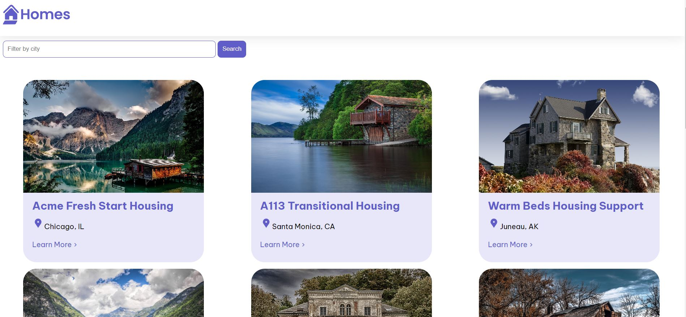

# HomesWebApp
 Angular Tutorial: Your first Angular App (with minor modifications)
 [Tutorial page:](https://angular.io/tutorial/first-app)
Simple web app which displays houses- one can filter according the city.

 # Topics
 - Creating components
 - Creating and using interfaces
 - Handling inputs from parent to child components using @Input decorator
 - How property binding works
 - How to pass data to components and how to interpolate values into a template
 - Using the ngFor directive
 - Creating a service and dependency injection
 - Routing
 - Add a form using Angular's forms feature
 - Connect the data captured in the form to a form using an event handler
 - Use template variables to interact with template values
 - Search functionality using event binding and array functions
 - Using asynchronous service methods to retrieve data and using a local web server (json-server)

# Running the application
## Starting the local web server for json data
`json-server --watch db.json`

## Starting the Angular application
`ng serve`
